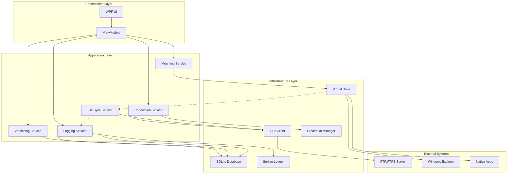
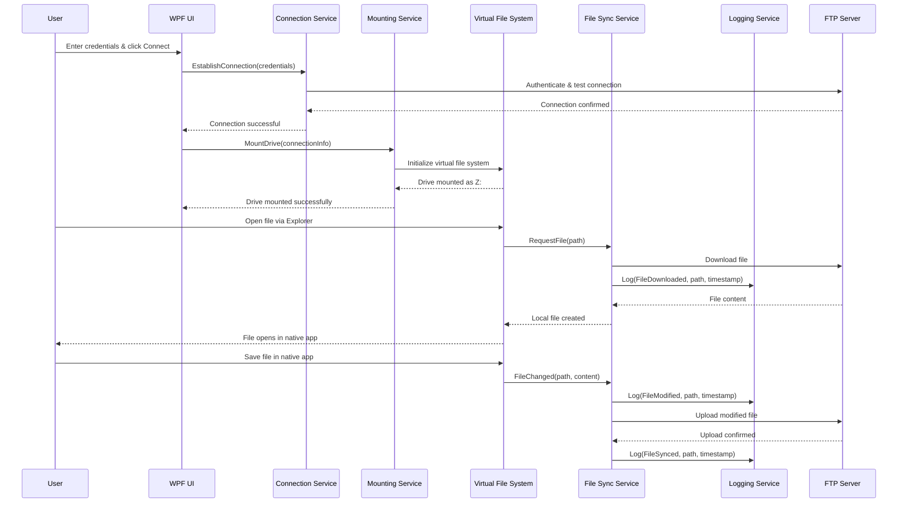

# FTP Virtual Drive Application - Architecture & Planning Document

## 1. Project Planning

### 1.1 High-Level Requirements & User Stories

#### Core User Stories
- **As a user**, I want to connect to an FTP/FTPS server using simple credentials (host, port, username, password) so I can access remote files securely.
- **As a user**, I want the FTP server to appear as a local drive (e.g., Z:) in Windows Explorer so I can work with files naturally.
- **As a user**, I want to open files directly in native applications (Word, Excel, etc.) so I can edit them without manual download/upload steps.
- **As a user**, I want my file changes to automatically sync back to the FTP server so I don't lose work or have version conflicts.
- **As a user**, I want to see a complete activity log of all file operations (additions, edits, deletions) so I can track what happened and when.
- **As a user**, I want to rollback files to previous versions so I can recover from mistakes or unwanted changes.

#### Secondary User Stories
- **As a user**, I want my credentials stored securely so I don't have to re-enter them every time.
- **As a user**, I want clear error messages when things go wrong so I can understand and fix issues.
- **As a user**, I want the drive to unmount cleanly when I close the application so there are no system conflicts.

### 1.2 Project Scope

#### MVP (Minimum Viable Product) - Week 1-2
- Basic FTP/FTPS connection with credential input UI
- Virtual drive mounting using Dokan.Net
- File read/write operations with basic sync
- Simple activity logging (file operations with timestamps)
- Clean unmount functionality

#### Full Version - Week 3-4
- Client-side versioning with rollback capabilities
- Advanced logging with detailed activity tracking
- Export functionality for logs
- Performance optimizations for large files
- Enhanced error handling and user feedback
- Credential management integration

### 1.3 Estimated Timeline

| Phase | Duration | Deliverables |
|-------|----------|-------------|
| **Setup & Core Infrastructure** | 3-4 days | Project structure, dependencies, basic UI |
| **FTP Integration** | 2-3 days | FluentFTP integration, connection management |
| **Virtual Drive Implementation** | 4-5 days | Dokan.Net integration, file system operations |
| **Logging & Versioning** | 3-4 days | Activity tracking, version management |
| **Testing & Polish** | 2-3 days | Error handling, UI improvements, testing |

**Total Estimated Timeline: 2-3 weeks**

### 1.4 Potential Risks & Mitigations

| Risk | Impact | Mitigation Strategy |
|------|--------|-------------------|
| **Dokan driver installation complexity** | High | Provide clear installation instructions, detect driver presence |
| **Performance degradation with large files** | Medium | Implement async operations, file caching, progress indicators |
| **FTP connection instability** | Medium | Connection pooling, retry mechanisms, offline mode |
| **File locking conflicts** | Medium | Implement proper file locking, conflict resolution UI |
| **Security vulnerabilities** | High | Use FTPS, secure credential storage, input validation |
| **Logging overhead** | Low | Async logging, configurable log levels, log rotation |

### 1.5 Technology Stack

- **.NET 8+**: Core framework
- **WPF**: Modern UI framework (preferred over WinForms for better styling)
- **FluentFTP**: FTP/FTPS client library with built-in logging
- **Dokan.Net**: Virtual file system implementation
- **SQLite + Entity Framework Core**: Local data storage
- **Serilog**: Structured logging framework
- **Microsoft.Extensions.DependencyInjection**: Dependency injection
- **Windows Credential Manager API**: Secure credential storage

## 2. Architecture Design

### 2.1 High-Level Architecture Diagram



### 2.2 Component Breakdown

#### 2.2.1 Presentation Layer
- **MainWindow.xaml**: Primary UI with connection form, status display, log viewer
- **ViewModels**: MVVM pattern implementation for data binding
- **Converters**: UI data conversion utilities

#### 2.2.2 Application Services
- **ConnectionService**: Manages FTP connections, authentication, connection pooling
- **MountingService**: Handles virtual drive mounting/unmounting via Dokan
- **LoggingService**: Centralized activity logging and log management
- **VersioningService**: Client-side file versioning and rollback functionality
- **FileSyncService**: Handles file synchronization between virtual drive and FTP server

#### 2.2.3 Infrastructure Layer
- **FtpClientWrapper**: Abstraction over FluentFTP with enhanced logging
- **VirtualFileSystem**: Dokan.Net implementation for file system operations
- **DataContext**: Entity Framework Core context for SQLite operations
- **CredentialManager**: Windows Credential Manager integration

### 2.3 Data Flow



### 2.4 Key Classes & Interfaces

#### 2.4.1 Core Interfaces

```csharp
// FTP Client Interface
public interface IFtpClient
{
    Task<bool> ConnectAsync(FtpConnectionInfo connectionInfo);
    Task<bool> DisconnectAsync();
    Task<Stream> DownloadFileAsync(string remotePath);
    Task<bool> UploadFileAsync(string remotePath, Stream content);
    Task<bool> DeleteFileAsync(string remotePath);
    Task<IEnumerable<FtpFileInfo>> ListDirectoryAsync(string remotePath);
    event EventHandler<FtpOperationEventArgs> OperationCompleted;
}

// Virtual Drive Interface
public interface IVirtualDrive
{
    Task<bool> MountAsync(string driveLetter, IFtpClient ftpClient);
    Task<bool> UnmountAsync();
    bool IsMounted { get; }
    string MountedDriveLetter { get; }
    event EventHandler<FileSystemEventArgs> FileOperation;
}

// Version Tracking Interface
public interface IVersionTracker
{
    Task SaveVersionAsync(string filePath, byte[] content, string hash);
    Task<IEnumerable<FileVersion>> GetVersionsAsync(string filePath);
    Task<byte[]> GetVersionContentAsync(string filePath, int versionId);
    Task<bool> RollbackToVersionAsync(string filePath, int versionId);
}

// Logging Service Interface
public interface ILoggerService
{
    Task LogActivityAsync(ActivityLog log);
    Task<IEnumerable<ActivityLog>> GetActivityLogsAsync(DateTime? from = null, DateTime? to = null);
    Task ExportLogsAsync(string filePath, LogExportFormat format);
}
```

#### 2.4.2 Data Models

```csharp
// Connection Information
public class FtpConnectionInfo
{
    public string Host { get; set; }
    public int Port { get; set; } = 21;
    public string Username { get; set; }
    public string Password { get; set; }
    public bool UseSSL { get; set; }
    public FtpSslValidation SslValidation { get; set; }
}

// Activity Log Model
public class ActivityLog
{
    public int Id { get; set; }
    public DateTime Timestamp { get; set; }
    public string Operation { get; set; } // Download, Upload, Delete, etc.
    public string FilePath { get; set; }
    public string Details { get; set; }
    public long? FileSize { get; set; }
    public string UserName { get; set; }
}

// File Version Model
public class FileVersion
{
    public int Id { get; set; }
    public string FilePath { get; set; }
    public DateTime CreatedAt { get; set; }
    public string ContentHash { get; set; }
    public long FileSize { get; set; }
    public byte[] Content { get; set; }
}
```

### 2.5 Detailed Component Implementation

#### 2.5.1 FTP Client Service

```csharp
public class FtpClientService : IFtpClient, IDisposable
{
    private readonly FtpClient _ftpClient;
    private readonly ILogger<FtpClientService> _logger;
    private readonly ILoggerService _activityLogger;
    
    public FtpClientService(ILogger<FtpClientService> logger, ILoggerService activityLogger)
    {
        _logger = logger;
        _activityLogger = activityLogger;
        _ftpClient = new FtpClient();
        
        // Configure FluentFTP logging
        _ftpClient.Config.LogToConsole = false;
        _ftpClient.Config.LogHost = false;
        _ftpClient.Logger = new SerilogAdapter(_logger);
    }
    
    public async Task<bool> ConnectAsync(FtpConnectionInfo connectionInfo)
    {
        try
        {
            _ftpClient.Host = connectionInfo.Host;
            _ftpClient.Port = connectionInfo.Port;
            _ftpClient.Credentials = new NetworkCredential(connectionInfo.Username, connectionInfo.Password);
            _ftpClient.Config.EncryptionMode = connectionInfo.UseSSL ? 
                FtpEncryptionMode.Explicit : FtpEncryptionMode.None;
            
            await _ftpClient.ConnectAsync();
            
            await _activityLogger.LogActivityAsync(new ActivityLog
            {
                Timestamp = DateTime.UtcNow,
                Operation = "Connect",
                Details = $"Connected to {connectionInfo.Host}:{connectionInfo.Port}",
                UserName = connectionInfo.Username
            });
            
            return true;
        }
        catch (Exception ex)
        {
            _logger.LogError(ex, "Failed to connect to FTP server");
            return false;
        }
    }
}
```

#### 2.5.2 Virtual File System Implementation

```csharp
public class FtpVirtualFileSystem : IDokanOperations, IVirtualDrive
{
    private readonly IFtpClient _ftpClient;
    private readonly IVersionTracker _versionTracker;
    private readonly ILoggerService _logger;
    private readonly ConcurrentDictionary<string, CachedFile> _fileCache;
    
    public async Task<bool> MountAsync(string driveLetter, IFtpClient ftpClient)
    {
        try
        {
            var dokanBuilder = new DokanInstanceBuilder(ftpClient)
                .ConfigureOptions(options =>
                {
                    options.DriveLetter = driveLetter[0];
                    options.ThreadCount = 5;
                    options.Options = DokanOptions.EnableNotificationAPI | DokanOptions.MountOnRoot;
                });
            
            await Task.Run(() => dokanBuilder.Build(this));
            return true;
        }
        catch (Exception ex)
        {
            _logger.LogError(ex, "Failed to mount virtual drive");
            return false;
        }
    }
    
    public NtStatus CreateFile(string fileName, DokanNet.FileAccess access, 
        FileShare share, FileMode mode, FileOptions options, FileAttributes attributes, 
        IDokanFileInfo info)
    {
        try
        {
            // Handle file creation/opening
            _logger.LogActivityAsync(new ActivityLog
            {
                Timestamp = DateTime.UtcNow,
                Operation = mode == FileMode.Create ? "Create" : "Open",
                FilePath = fileName,
                Details = $"File {mode} operation"
            });
            
            return NtStatus.Success;
        }
        catch
        {
            return NtStatus.Error;
        }
    }
}
```

### 2.6 Database Schema (SQLite)

```sql
-- Activity Logs Table
CREATE TABLE ActivityLogs (
    Id INTEGER PRIMARY KEY AUTOINCREMENT,
    Timestamp TEXT NOT NULL,
    Operation TEXT NOT NULL,
    FilePath TEXT NOT NULL,
    Details TEXT,
    FileSize INTEGER,
    UserName TEXT,
    CreatedAt TEXT DEFAULT CURRENT_TIMESTAMP
);

-- File Versions Table
CREATE TABLE FileVersions (
    Id INTEGER PRIMARY KEY AUTOINCREMENT,
    FilePath TEXT NOT NULL,
    VersionNumber INTEGER NOT NULL,
    ContentHash TEXT NOT NULL,
    FileSize INTEGER NOT NULL,
    Content BLOB NOT NULL,
    CreatedAt TEXT DEFAULT CURRENT_TIMESTAMP,
    UNIQUE(FilePath, VersionNumber)
);

-- Connection History Table
CREATE TABLE ConnectionHistory (
    Id INTEGER PRIMARY KEY AUTOINCREMENT,
    Host TEXT NOT NULL,
    Port INTEGER NOT NULL,
    Username TEXT NOT NULL,
    LastConnected TEXT,
    IsSuccessful BOOLEAN DEFAULT FALSE
);
```

### 2.7 Project Structure

```
FtpVirtualDrive/
├── src/
│   ├── FtpVirtualDrive.Core/           # Core business logic
│   │   ├── Interfaces/
│   │   ├── Services/
│   │   ├── Models/
│   │   └── Exceptions/
│   ├── FtpVirtualDrive.Infrastructure/ # External integrations
│   │   ├── FTP/
│   │   ├── VirtualFileSystem/
│   │   ├── Database/
│   │   └── Security/
│   ├── FtpVirtualDrive.UI/            # WPF Application
│   │   ├── Views/
│   │   ├── ViewModels/
│   │   ├── Converters/
│   │   └── Resources/
│   └── FtpVirtualDrive.Tests/         # Unit & Integration Tests
├── docs/
├── scripts/
└── README.md
```

### 2.8 Key Implementation Considerations

#### 2.8.1 Security Best Practices
- **Credential Storage**: Use Windows Credential Manager for secure storage
- **FTPS Configuration**: Enforce certificate validation, support custom certificates
- **Input Validation**: Sanitize all user inputs, validate FTP paths
- **Encryption**: Use secure protocols only (FTPS), no plain FTP for production

#### 2.8.2 Performance Optimizations
- **Async Operations**: All FTP operations must be asynchronous
- **File Caching**: Cache frequently accessed files locally
- **Connection Pooling**: Reuse FTP connections when possible
- **Background Sync**: Use background tasks for file synchronization

#### 2.8.3 Error Handling Strategy
- **Graceful Degradation**: Continue operating when possible during connection issues
- **User-Friendly Messages**: Convert technical errors to understandable messages
- **Retry Logic**: Implement exponential backoff for transient failures
- **Offline Mode**: Allow read-only access to cached files when disconnected

### 2.9 Logging Integration Strategy

#### 2.9.1 FluentFTP + Serilog Integration

```csharp
public class SerilogFtpLogger : IFtpLogger
{
    private readonly ILogger _logger;
    
    public void Log(FtpLogLevel level, string message)
    {
        var serilogLevel = MapLogLevel(level);
        _logger.Write(serilogLevel, "FTP: {Message}", message);
        
        // Extract and log activity if it's an operation
        if (IsFileOperation(message))
        {
            var activity = ParseFtpOperation(message);
            // Send to activity logger
        }
    }
}

// Serilog Configuration
Log.Logger = new LoggerConfiguration()
    .MinimumLevel.Debug()
    .WriteTo.File("logs/app-.log", rollingInterval: RollingInterval.Day)
    .WriteTo.SQLite("Data/logs.db", "ActivityLogs")
    .CreateLogger();
```

### 2.10 Dependency Injection Setup

```csharp
// Program.cs or App.xaml.cs
public void ConfigureServices(IServiceCollection services)
{
    // Core Services
    services.AddSingleton<IFtpClient, FtpClientService>();
    services.AddSingleton<IVirtualDrive, DokanVirtualDrive>();
    services.AddScoped<IVersionTracker, VersionTrackingService>();
    services.AddScoped<ILoggerService, ActivityLoggingService>();
    services.AddScoped<IFileSyncService, FileSynchronizationService>();
    
    // Infrastructure
    services.AddDbContext<AppDbContext>(options =>
        options.UseSqlite("Data Source=app.db"));
    services.AddSingleton<ICredentialManager, WindowsCredentialManager>();
    
    // ViewModels
    services.AddTransient<MainViewModel>();
    services.AddTransient<ConnectionViewModel>();
    services.AddTransient<LogViewerViewModel>();
    
    // Logging
    services.AddLogging(builder => builder.AddSerilog());
}
```

### 2.11 Implementation Phases

#### Phase 1: Foundation (Days 1-4)
1. **Project Setup**: Create solution structure, add NuGet packages
2. **Basic UI**: Create connection form with credential inputs
3. **FTP Integration**: Implement basic FTP connection using FluentFTP
4. **Credential Management**: Integrate Windows Credential Manager

#### Phase 2: Core Functionality (Days 5-9)
1. **Dokan Integration**: Implement virtual file system operations
2. **File Operations**: Handle read/write operations with FTP sync
3. **Basic Logging**: Implement activity logging to SQLite
4. **Error Handling**: Add comprehensive error handling and user feedback

#### Phase 3: Advanced Features (Days 10-14)
1. **Versioning System**: Implement client-side file versioning
2. **Advanced Logging**: Enhanced activity tracking and log export
3. **Performance Optimization**: Add caching, async operations
4. **Testing**: Comprehensive testing and bug fixes

#### Phase 4: Polish & Deployment (Days 15-18)
1. **UI Polish**: Improve user experience, add progress indicators
2. **Documentation**: Create user manual and technical documentation
3. **Installer**: Create MSI installer with Dokan driver bundling
4. **Final Testing**: End-to-end testing and performance validation

### 2.12 Testing Strategy

- **Unit Tests**: Mock FTP operations, test business logic
- **Integration Tests**: Test FTP connectivity, database operations
- **UI Tests**: Automated UI testing using TestStack.White
- **Performance Tests**: Load testing with large files
- **Security Tests**: Credential handling, encryption validation

### 2.13 Deployment Considerations

- **Prerequisites**: .NET 8 Runtime, Dokan driver installation
- **Installer**: MSI package with driver bundling and automatic installation
- **Updates**: Auto-update mechanism for application updates
- **Logging**: Central error reporting for troubleshooting

This architecture provides a solid foundation for building a robust FTP virtual drive application that meets all your specified requirements while following .NET best practices and ensuring maintainability and scalability.
